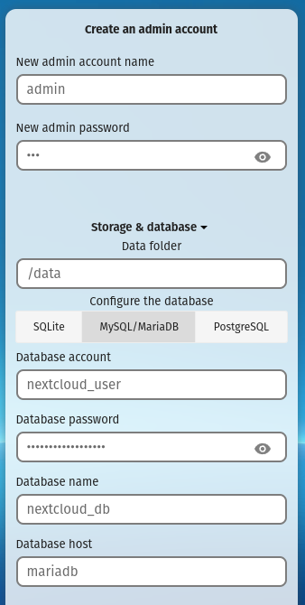

---
tags:
  - Containers
---
# Optimizing Nextcloud

A step by step guide for setting up:
- [SWAG](https://github.com/linuxserver/docker-swag) reverse proxy via cloudflare
- [Nextcloud](https://github.com/linuxserver/docker-nextcloud)
- Redis
- [Mariadb](https://github.com/linuxserver/docker-mariadb)
- Collabora
- Notify push
- Talk high performance backend
- Whiteboard
- Imaginary

!!! warning ""

    Replace all occurences of `domain.com` with your domain.

## SWAG

- Create a [Cloudflare](https://dash.cloudflare.com) account and set it as the nameserver for your domain.
- Create DNS records for `domain.com` and `*.domain.com` with your home's WAN IP, disable the orange cloud.
- Port forward `443` to your server on your home router.
- Add SWAG to your docker compose and start it.
    ```yaml
    swag:
      image: lscr.io/linuxserver/swag:latest
      container_name: swag
      cap_add:
        - NET_ADMIN
      environment:
        - PUID=1000
        - PGID=1000
        - TZ=Etc/UTC
        - URL=domain.com
        - VALIDATION=dns
        - SUBDOMAINS=wildcard
        - DNSPLUGIN=cloudflare
        - PROPAGATION=60
        - SWAG_AUTORELOAD=true
      volumes:
        - /path/to/swag:/config
      ports:
        - 443:443
        - 80:80
      restart: unless-stopped
    ```
- Generate a Cloudflare [API token](https://dash.cloudflare.com/profile/api-tokens) with `DNS:Read, DNS:Edit` permissions to `domain.com` and copy the token.
- Edit `/path/to/swag/dns-conf/cloudflare.ini`, delete everything and paste the following with your token:
  ```ini
  dns_cloudflare_api_token = token
  ```
- Rename `/path/to/swag/nginx/proxy-confs/nextcloud.subdomain.conf.sample` to `nextcloud.subdomain.conf`.
- Edit `/path/to/swag/nginx/ssl.conf` and uncomment HSTS and all the additional headers on the bottom.
- Restart SWAG and make sure that `domain.com` shows the welcome page with a valid certificate.

## Nextcloud

- Add [Nextcloud](https://github.com/linuxserver/docker-nextcloud), [Mariadb](https://github.com/linuxserver/docker-mariadb), and Redis to your docker compose and start them.
    ```yaml
    nextcloud:
      image: lscr.io/linuxserver/nextcloud:latest
      container_name: nextcloud
      environment:
        - PUID=1000
        - PGID=1000
        - TZ=Etc/UTC
      volumes:
        - /path/to/nextcloud/config:/config
        - /path/to/nextcloud/data:/data
      restart: unless-stopped
      depends_on:
        - mariadb
    mariadb:
      image: lscr.io/linuxserver/mariadb:latest
      container_name: mariadb
      environment:
        - PUID=1000
        - PGID=1000
        - TZ=Etc/UTC
        - MYSQL_ROOT_PASSWORD=nextcloud_root_password
        - MYSQL_DATABASE=nextcloud_db
        - MYSQL_USER=nextcloud_user
        - MYSQL_PASSWORD=nextcloud_password
      volumes:
        - /path/to/mariadb:/config
      restart: unless-stopped
    redis:
      image: redis:alpine
      container_name: redis
      restart: unless-stopped
    ```
- Navigate to `https://nextcloud.domain.com` and fill out the details for Nextcloud and Mariadb.
    
    

- Select recommended apps to install.
- Run the following commands.
    ```bash
    docker exec nextcloud occ app:disable richdocumentscode
    docker exec nextcloud occ maintenance:repair --include-expensive
    docker exec nextcloud occ db:add-missing-indices
    docker exec -u abc nextcloud mkdir -p /config/log/nextcloud
    docker exec nextcloud occ config:system:set overwrite.cli.url --value='https://nextcloud.domain.com'
    docker exec nextcloud occ config:system:set memcache.local --value='\\OC\\Memcache\\APCu'
    docker exec nextcloud occ config:system:set memcache.locking --value='\\OC\\Memcache\\Redis'
    docker exec nextcloud occ config:system:set memcache.distributed --value='\\OC\\Memcache\\Redis'
    docker exec nextcloud occ config:system:set logfile --value='/config/log/nextcloud/nextcloud.log'
    docker exec nextcloud occ config:system:set trusted_proxies 0 --value='172.16.0.0/12'
    docker exec nextcloud occ config:system:set trusted_proxies 1 --value='127.0.0.1'
    docker exec nextcloud occ config:system:set trusted_proxies 2 --value='::1'
    docker exec nextcloud occ config:system:set redis host --value='redis'
    docker exec nextcloud occ config:system:set redis port --value=6379 --type=integer
    docker exec nextcloud occ config:system:set loglevel --value=2 --type=integer
    docker exec nextcloud occ config:system:set log_rotate_size --value=10485760 --type=integer
    docker exec nextcloud occ config:system:set maintenance_window_start --value=1 --type=integer
    docker exec nextcloud occ config:system:set filesystem_check_changes --value=1 --type=integer
    docker exec nextcloud occ config:system:set filelocking.enabled --value=true --type=boolean
    ```
- Add the following to `/path/to/nextcloud/config/php/www2.conf`.
  ```ini
  pm = dynamic
  pm.max_children = 120
  pm.start_servers = 12
  pm.min_spare_servers = 6
  pm.max_spare_servers = 18
  ```
- Restart Nextcloud to apply the changes.

## Collabora

- Add Collabora to your docker compose and start it.
    ```yaml
    collabora:
      image: collabora/code
      container_name: collabora
      environment:
        - DONT_GEN_SSL_CERT=1
        - aliasgroup1=https://nextcloud.domain.com
        - dictionaries=en_US
        - server_name=nextcloud.domain.com
        - extra_params=--o:security.capabilities=false --o:ssl.enable=false --o:ssl.termination=true --o:logging.level=warning --o:net.post_allow.host[0]=.+ --o:home_mode.enable=true --o:mount_jail_tree=false --o:mount_namespaces=false  --o:remote_font_config.url=https://nextcloud.domain.com/apps/richdocuments/settings/fonts.json
      restart: unless-stopped
      cap_add:
        - SYS_CHROOT
        - MKNOD
    ```
- Add the following locations to `/path/to/swag/nginx/proxy-confs/nextcloud.subdomain.conf` inside the `server` section.
    ```nginx
    location ^~ /browser/ {
        include /config/nginx/proxy.conf;
        include /config/nginx/resolver.conf;
        set $upstream_app collabora;
        set $upstream_port 9980;
        set $upstream_proto http;
        proxy_pass $upstream_proto://$upstream_app:$upstream_port;
    }
    location ^~ /hosting/ {
        include /config/nginx/proxy.conf;
        include /config/nginx/resolver.conf;
        set $upstream_app collabora;
        set $upstream_port 9980;
        set $upstream_proto http;
        proxy_pass $upstream_proto://$upstream_app:$upstream_port;
    }
    location ^~ /cool/ {
        include /config/nginx/proxy.conf;
        include /config/nginx/resolver.conf;
        set $upstream_app collabora;
        set $upstream_port 9980;
        set $upstream_proto http;
        proxy_pass $upstream_proto://$upstream_app:$upstream_port;
    }
    ```
- Run the following commands.
    ```bash
    docker exec nextcloud occ app:enable richdocuments
    docker exec nextcloud occ config:app:set richdocuments wopi_url --value https://nextcloud.domain.com
    docker exec nextcloud occ config:app:set richdocuments wopi_allowlist --value=0.0.0.0/0
    docker exec nextcloud occ config:app:set richdocuments doc_format --value=ooxml
    ```
- Disable Collabora's dark mode under View > Dark Mode.

## Notify Push

- Add the following environment variable to Nextcloud's docker compose and recreate it.
    ```yaml
    environment:
      - DOCKER_MODS=linuxserver/mods:nextcloud-notify-push
    ```

## Talk High Performance Backend

- Generate 3 secrets using the following command and paste them to the compose below.
    ```bash
    openssl rand -hex 32
    ```
- Add the High Performance Backend to your docker compose and start it.
    ```yaml
    talk:
      image: nextcloud/aio-talk:latest
      container_name: talk
      init: true
      ports:
        - 3478:3478/tcp
        - 3478:3478/udp
      environment:
        - NC_DOMAIN=nextcloud.domain.com
        - TALK_HOST=talk.domain.com
        - TZ=Etc/UTC
        - TALK_PORT=3478
        - TURN_SECRET=secret
        - SIGNALING_SECRET=secret
        - INTERNAL_SECRET=secret
      restart: unless-stopped
    ```
- Paste the following to the bottom of `/path/to/swag/nginx/proxy-confs/nextcloud.subdomain.conf`.
    ```nginx
    server {
        listen 443 ssl;
        listen [::]:443 ssl;
        server_name talk.*;
        include /config/nginx/ssl.conf;
        client_max_body_size 0;

        location / {
            include /config/nginx/proxy.conf;
            include /config/nginx/resolver.conf;
            set $upstream_app talk;
            set $upstream_port 8081;
            set $upstream_proto http;
            proxy_pass $upstream_proto://$upstream_app:$upstream_port;
        }
    }
    ```

- Run the following commands using the secrets generated earlier.
  ```bash
  docker exec nextcloud occ talk:signaling:add --verify https://talk.domain.com SIGNALING_SECRET
  docker exec nextcloud occ talk:stun:add talk.domain.com:3478
  docker exec nextcloud occ talk:turn:add --secret TURN_SECRET turn talk.domain.com:3478 udp,tcp
  ```
- Optionally port forward `3478` on your router to expose it.

## Whiteboard

- Generate a secret using the following command and paste it below.
    ```bash
    openssl rand -hex 32
    ```
- Add Whiteboard to your docker compose and start it.
    ```yaml
    whiteboard:
      image: ghcr.io/nextcloud-releases/whiteboard:release
      container_name: whiteboard
      environment:
        - NEXTCLOUD_URL=https://nextcloud.domain.com
        - STORAGE_STRATEGY=redis
        - REDIS_HOST=redis
        - JWT_SECRET_KEY=secret
      restart: unless-stopped
    ```
- Paste the following to the bottom of `/path/to/swag/nginx/proxy-confs/nextcloud.subdomain.conf`.
    ```nginx
    server {
        listen 443 ssl;
        listen [::]:443 ssl;
        server_name whiteboard.*;
        include /config/nginx/ssl.conf;
        client_max_body_size 0;

        location / {
            include /config/nginx/proxy.conf;
            include /config/nginx/resolver.conf;
            set $upstream_app whiteboard;
            set $upstream_port 3002;
            set $upstream_proto http;
            proxy_pass $upstream_proto://$upstream_app:$upstream_port;
        }
    }
    ```
- Run the following commands.
  ```bash
  docker exec nextcloud occ app:enable whiteboard
  docker exec nextcloud occ config:app:set whiteboard collabBackendUrl --value="https://whiteboard.domain.com"
  docker exec nextcloud occ config:app:set whiteboard jwt_secret_key --value="secret"
  ```

## Imaginary

- Add Imaginary to your docker compose and start it.
    ```yaml
    imaginary:
      image: nextcloud/aio-imaginary:latest
      container_name: imaginary
      restart: unless-stopped
    ```
- Run the following commands.
  ```bash
  docker exec nextcloud occ config:system:set enable_previews --value=true --type=boolean
  docker exec nextcloud occ config:system:set enabledPreviewProviders 0 --value='OC\\Preview\\Imaginary'
  docker exec nextcloud occ config:system:set enabledPreviewProviders 1 --value='OC\\Preview\\Movie'
  docker exec nextcloud occ config:system:set enabledPreviewProviders 2 --value='OC\\Preview\\MP4'
  docker exec nextcloud occ config:system:set preview_imaginary_url --value='http://imaginary:9000'
  ```
