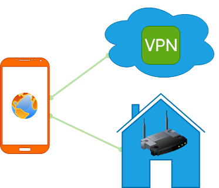

---
tags:
  - Network
---

# Split Tunnel


This setup allows your phone to **always** be connected to **both** your VPN provider and to your home.

### TLDR

Set the home [Wireguard server](https://github.com/linuxserver/docker-wireguard/) to the same subnet as the IP you got from your VPN provider and split the allowed IPs with the [Wireguard AllowedIPs Calculator](https://www.procustodibus.com/blog/2021/03/wireguard-allowedips-calculator/).

## Requirements

- A VPN provider that supports Wireguard
- A home [Wireguard server](https://github.com/linuxserver/docker-wireguard/)
- An Android phone
- The official Wireguard application

## VPN Provider Configuration

The VPN provider will provide you with a Wireguard config or a QR code, for example:

`PublicKey = aV/aFODKJH5894674CtdyhPDDFiE/qwe/1xnRM=`
```INI
[Interface]
PrivateKey = EFvrTq36k22b+DXN6788bOIeONjklb2KLVPVj/CUd3o=
Address = 10.22.46.77/32,fc00:bbbb:bbbb:bb01::2:d2ab/128
DNS = 193.138.44.22

[Peer]
PublicKey = aV/aDhwG0fmp0XuvSnbmWjCtdyhPDDFiE/qwe/1xnRM=
AllowedIPs = 0.0.0.0/0,::0/0
Endpoint = 193.8.66.48:51820
```

Verify that it works by connecting the phone to it.

## Home Wireguard Configuration

Set the home Wireguard server to the same subnet as the IP provided by your VPN provider.

In this example the home Wireguard server should have this configuration:

- IP Address - `10.22.46.1`
- Subnet - `10.22.46.0/24`

Create a client configuration for your phone with the same IP address, private key, and public key.

In this example the home Wireguard server should have a client with this configuration:

- IP Address - `10.22.46.77/32`
- PublicKey - `aV/aFODKJH5894674CtdyhPDDFiE/qwe/1xnRM=`
- PrivateKey - `EFvrTq36k22b+DXN6788bOIeONjklb2KLVPVj/CUd3o=`

Verify that it works by connecting the phone to it.

## Merging the Tunnels

Edit the connection to the VPN provider > Add Peer:

- Public Key - Copy the public key of the home Wireguard server.
- Endpoint - `your.domain.com:51820` (replace with your domain and Wireguard server port)
- Allowed IPs - The home network subnet, for example: `192.168.1.0/24`

Navigate to the [Wireguard AllowedIPs Calculator](https://www.procustodibus.com/blog/2021/03/wireguard-allowedips-calculator/), set Allowed IPs to `0.0.0.0/0, ::/0` and Disallowed IPs to the home network subnet, for example: `192.168.1.0/24`, click Calculate and copy the result, for example:
```
0.0.0.0/1, 128.0.0.0/2, 192.0.0.0/9, 192.128.0.0/11, 192.160.0.0/13, 192.168.0.0/24, 192.168.2.0/23, 192.168.4.0/22, 192.168.8.0/21, 192.168.16.0/20, 192.168.32.0/19, 192.168.64.0/18, 192.168.128.0/17, 192.169.0.0/16, 192.170.0.0/15, 192.172.0.0/14, 192.176.0.0/12, 192.192.0.0/10, 193.0.0.0/8, 194.0.0.0/7, 196.0.0.0/6, 200.0.0.0/5, 208.0.0.0/4, 224.0.0.0/3, ::/0
```
Paste the result into the first peer (the VPN provider peer) under Allowed IPs.

Lastly, change the DNS servers field to the IP of the home DNS if needed (make sure the DNS address is within the Allowed IPs of the home Wireguard server peer).

### Example Client Config

```ini
[Interface]
Address = 10.167.26.220/32, fc00:bbbb:bbbb:bb05::2:d8db/128
DNS = 10.1.1.1
PrivateKey = redacted

[Peer]
AllowedIPs = 10.1.1.0/24
Endpoint = home.com:51820
PublicKey = redacted

[Peer]
AllowedIPs = 0.0.0.0/5, 8.0.0.0/7, 10.0.0.0/16, 10.1.0.0/24, 10.1.2.0/23, 10.1.4.0/22, 10.1.8.0/21, 10.1.16.0/20, 10.1.32.0/19, 10.1.64.0/18, 10.1.128.0/17, 10.2.0.0/15, 10.4.0.0/14, 10.8.0.0/13, 10.16.0.0/12, 10.32.0.0/11, 10.64.0.0/10, 10.128.0.0/9, 11.0.0.0/8, 12.0.0.0/6, 16.0.0.0/4, 32.0.0.0/3, 64.0.0.0/2, 128.0.0.0/1, ::/0
Endpoint = 193.32.127.70:51820
PublicKey = redacted
```

## Additional Configuration

### DNS Access List

The Wireguard server subnet may need to be added to the DNS access list, for example in OPNSense under Services > Unbound DNS > Access Lists > Add > allow `10.22.46.0/24`.

### Reverse Proxy

The Wireguard server subnet may need to be added to the reverse proxy's LAN IP ranges, for example in SWAG it should be added to [Allow/Deny](https://www.linuxserver.io/blog/securing-swag#internal-applications) and to [Geoblock](https://www.linuxserver.io/blog/securing-swag#geoblock).

### Always-on

The tunnel can stay connected at all times, even when you're at home, it can be enabled under Settings > Network & Internet > Advanced > VPN > Wireguard Settings > Enable Always-on VPN.

## Troubleshoot

### Push notifications are not working
In the Wireguard app edit the tunnel configuration and add an application exclusion for Google Play services.

### The phone battery is being drained quickly
Make sure that you didn't set a Persistent Keep-alive on either the server Wireguard configuration or the client tunnel configuration.