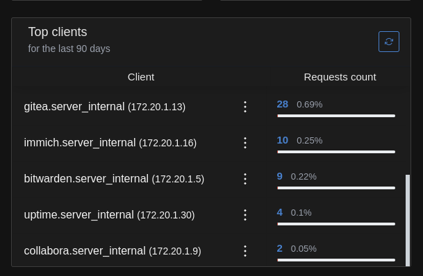

# DNS for Containers

## Problem

The common setup is to have a server with many containers, and a network DNS such as pihole or adguardhome.

The issue is that all dns queries by the server and all containers are grouped into a single bucket on the network DNS, making it difficult to track malicious DNS queries by a single container.

## Solution



Create an adguardhome container for all the other containers to use as their DNS, and set the host as the upstream DNS for reverse lookups, so that container names will be displayed instead of IPs.

These are the general steps with an example below:

- Create a bridge network with a static subnet.
- Create an adguardhome container with a static IP in that subnet.
- Assign all other containers static IPs in that subnet as well.
- Set the DNS of all other containers to the static IP of adguardhome.
- Set all other containers to depend on adguardhome.

```yaml
networks:
  internal:
    driver: bridge
    ipam:
      config:
        - subnet: 172.20.0.0/16
services:
  agh:
    image: adguard/adguardhome
    container_name: agh
    volumes:
      - /path/to/agh/conf:/opt/adguardhome/conf
      - /path/to/agh/work:/opt/adguardhome/work
    networks:
      internal:
        ipv4_address: 172.20.20.20
    ports:
      - 13080:80
      - 13000:3000
  someapp:
    networks:
      internal:
        ipv4_address: 172.20.0.2
    dns: 172.20.20.20
    depends_on:
        - agh
```

## AdguardHome Configuration

Go through the initial configuration on port 13000 and switch to port 13080 to access the web-ui.

Settings > General settings

- Block domains using filters and hosts files: Uncheck
- Enable log: Check
- Query logs rotation: 90 days
- Ignored domains: ||your-private-domain.tld^
- Enable statistics: Check
- Statistics retention: 90 days
- Ignored domains: ||your-private-domain.tld^

Settings > DNS settings

- Upstream DNS servers: `127.0.0.11`.
- Private reverse DNS servers: `127.0.0.11:53`.
- Use private reverse DNS resolvers: Check
- Rate limit: 0
