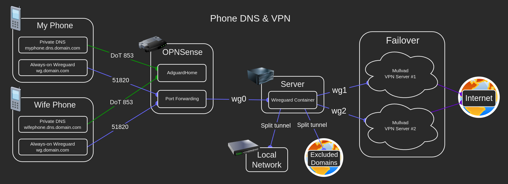
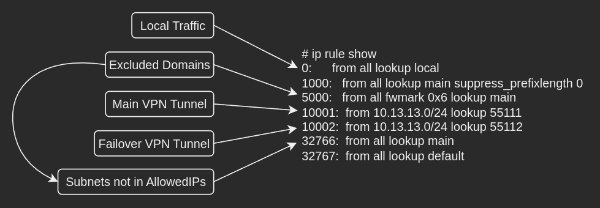
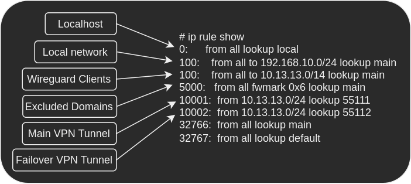

# Wireguard Hub


Linuxserver's Wireguard container is extremely versatile, in this example we'll use it as a server that tunnels clients through multiple redundant vpn connections while maintaining access to the LAN.

VPN providers have a limit on the amount of devices, this setup will allow you to have an unlimited amount of devices tunneled through a single VPN connection while also supporting a failover backup connection!

Objectives:

- Implement in a single wireguard server container.
- Allow unlimited clients to connect to the wireguard server container and utilize the same VPN connection.
- Support a fallback VPN connection for increased reliability.
- Support accessing LAN devices over wireguard.
- Support excluding domains that block VPNs.
- Support tunneling other containers through the same VPN connection.
- Support tunneling entire VLANs and hosts through the same VPN connection.

## Instructions

Clone the [following boilerplate](https://github.com/quietsy/wireguard-hub):

```bash
git clone https://github.com/quietsy/wireguard-hub.git
```

### Server Template

Replace `CHANGETHIS` with your LAN subnet under `wireguard/templates/server.conf`.

### Client Tunnels

* Obtain 2 wireguard vpn configurations from your vpn provider (mullvad and torguard have been tested).
* Replace `CHANGETHIS` with your vpn configurations under:
  * `wireguard/wg_confs/wg1.conf`
  * `wireguard/wg_confs/wg2.conf`


### Wireguard Server Container

Configure a Wireguard server container according to the [Wireguard documentation](https://github.com/linuxserver/docker-wireguard) with the `wireguard` folder of the boilerplate mounted to `/config`.

```YAML
services:
  wireguard:
    image: lscr.io/linuxserver/wireguard:latest
    container_name: wireguard
    cap_add:
      - NET_ADMIN
    environment:
      - PUID=1000
      - PGID=1000
      - TZ=Etc/UTC
      - SERVERURL=wireguard.domain.com
      - SERVERPORT=51820
      - PEERS=1
      - PEERDNS=auto
      - INTERNAL_SUBNET=10.13.13.0
      - ALLOWEDIPS=0.0.0.0/0
      - LOG_CONFS=true
      - DOCKER_MODS=linuxserver/mods:universal-package-install
      - INSTALL_PACKAGES=ipset
    volumes:
      - ./wireguard:/config
    ports:
      - 51820:51820/udp
    sysctls:
      - net.ipv4.conf.all.src_valid_mark=1
    restart: unless-stopped
```

Create the container and perform the following checks to verify that the VPN tunnels works:

- Check that `docker logs wireguard` contains no errors, and check that the server is working properly by connecting a client to it.
- Check that you have connectivity on wg1 by running `docker exec wireguard ping -c4 -I wg1 1.1.1.1`.
- Check that you have connectivity on wg2 by running `docker exec wireguard ping -c4 -I wg2 1.1.1.1`.
- Check the details of your VPN tunnel on wg1 by running `docker exec wireguard curl --interface wg1 -s https://am.i.mullvad.net/json`, you should get an IP that is different from your WAN IP.
- Check the details of your VPN tunnel on wg2 by running `docker exec wireguard curl --interface wg2 -s https://am.i.mullvad.net/json`, you should get an IP that is different from your WAN IP.
- Connect to the tunnel with a client device and navigate to `https://am.i.mullvad.net/json`, verify that the server is working properly and that you're tunneled through one the VPN tunnels.

## Bypassing the VPN for specific sites (optional)

### Manual

Add domains that would bypass the VPN to `wireguard/unblock/domains.txt`.

### Web-UI



There's a basic web-ui for adding sites to the file under `wireguard/unblock/index.php`.

You can host it on [SWAG](https://github.com/linuxserver/docker-swag) by adding the following mounts to SWAG's compose:

```yaml
    volumes:
      - ./wireguard/unblock:/config/unblock
      - ./wireguard/unblock/unblock.subdomain.conf:/config/nginx/proxy-confs/unblock.subdomain.conf:ro
```

Recreate SWAG and navigate to `https://unblock.domain.com`, test that it adds domains to `wireguard/unblock/domains.txt`.

## Routing other containers through the tunnel (optional)

Other containers can be routed through the hub by adding another wireguard container in client mode.

### Wireguard Client Container

- Add a new peer to the wireguard server container using the `PEERS` environment variable, and recreate it.
- Create another wireguard container, this time in client mode, according to the [VPN Route guide](/vpn/).
- Copy the peer's `./wireguard/peer#/peer#.conf` from the server to the client's `./wgclient/wg_confs/wg0.conf`.
- Set the `Endpoint` to be the server container: `Endpoint = wireguard:51820`.
- Add `PostUp` and `PreDown` rules according to the VPN Route guide.
- Create the container for changes to take effect.

### Port forwarding (optional)

- Uncomment the port forwarding `PostUp` and `PreDown` rules in `wg1.conf` and `wg2.conf`.
- Replace `10.13.13.2` with the wireguard client peer IP.
- Replace `45678` with the port of the app.
- Replace `12345` with the port you got from the vpn provider for each tunnel.
- Duplicate the rules for udp if needed.
- Restart the container for changes to take effect.

## Routing on OPNSense (optional)

VLANs and hosts can be routed through the hub via OPNSense.

- Add a new peer to the wireguard server container using the `PEERS` environment variable, and recreate it.
- Follow [https://docs.opnsense.org/manual/how-tos/wireguard-selective-routing.html](https://docs.opnsense.org/manual/how-tos/wireguard-selective-routing.html).

Step 1:

- Set `Public Key` to the server's public key from `./wireguard/server/publickey-server`.
- Set `Allowed IPs` to `0.0.0.0/0`.
- Set `Endpoint Address` to the server's LAN IP.
- Set `Endpoint Port` to `51820`.
- Set `Keepalive` to `25`.

Step 2:

- Set `Public Key` to the peer's public key from `./wireguard/peer#/publickey-peer#`.
- Set `Private Key` to the peer's public key from `./wireguard/peer#/privatekey-peer#`.
- Set `Listen Port` to `51820`.
- Set `Tunnel Address` to the peer's address as listed under`[interface]` in `./wireguard/peer#/peer#.conf`.
- Select your peer under `Peers`.
- Check `Disable Routes`.
- Set `Gateway` to `10.13.13.200`.

Follow the rest of the guide.

## Traffic Overview



The order of traffic is as follows:

1. Localhost - traffic to the container.
2. Local network - traffic the DNS and gateway.
3. Wireguard clients - traffic to the wireguard clients.
4. Excluded domains - bypasses the VPN and routes directly.
5. Main VPN tunnel - the VPN tunnel in `wg1.conf`.
6. Failover VPN tunnel - the VPN tunnel in `wg2.conf`.