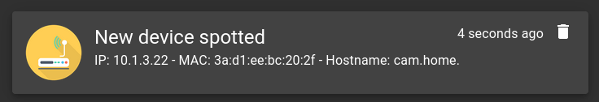

# OPN-Arp

OPN-Arp on OPNSense allows you to send alerts when new devices are spotted on the network.



## Setup

- Install the `opn-arp` plugin via the [community repo](https://www.routerperformance.net/opnsense-repo/)
- Enable OPN-Arp under Services > OPN-Arp
- Enable Monit under Services > Monit
- Add a new entry under Service Tests Settings:
  - Name: `MAC pair`
  - Condition: `content = "MAC pair"`
  - Action: `Alert` for an email alert or `Execute` and `/root/gotify.sh` for gotify (script below)
- Add a new entry under Service Settings:
  - Name: `MAC_PAIR`
  - Type: `File`
  - Path: `/var/log/system/latest.log`
  - Tests: `MAC Pair`
- Add a new entry under Alert Settings: (only for email alerts)
  - Recipient: `your@email.com`
  - Mail Format: `From: your@email.com`
- Fill the mail server details under general (only for email alerts)

## Gotify Alerts

- Connect to OPNSense via SSH
- Execute `touch /root/gotify.sh && chmod +x /root/gotify.sh`
- Paste the following script into `/root/gotify.sh`:

    ```bash
    #!/usr/local/bin/bash

    if [[ $MONIT_DESCRIPTION =~ "MAC pair" ]]; then
            ip=$(echo $MONIT_DESCRIPTION | cut -d '(' -f 2  | cut -d ')' -f 1)
            mac=$(echo $MONIT_DESCRIPTION | cut -d '(' -f 2  | cut -d ')' -f 2)
            host=$(host $ip | cut -d ' ' -f 5)
            title="New device spotted"
            msg="IP: $ip - MAC: $mac - Hostname: $host"
    else
            title=$MONIT_SERVICE
            msg=$MONIT_DESCRIPTION
    fi

    curl -X POST "https://gotify.domain.com/message?token=yourtoken" -F "title=$title" -F "message=$msg"
    ```

- Edit `gotify.domain.com` and `yourtoken` accordingly
- Create a file under `/usr/local/etc/rc.syshook.d/start/99-opnarp`:

    ```sh
    #!/bin/sh

    chmod +x /usr/local/etc/rc.d/opnarp
    ```

- Test it by running:
  
  ```bash
  echo "<29>1 2022-08-29T20:16:44+03:00 router.home root 59285 - [meta sequenceId=1] New IPv4/MAC pair seen: (10.1.3.22)3a:d1:ee:bc:20:2f" >> /var/log/system/latest.log
  ```
