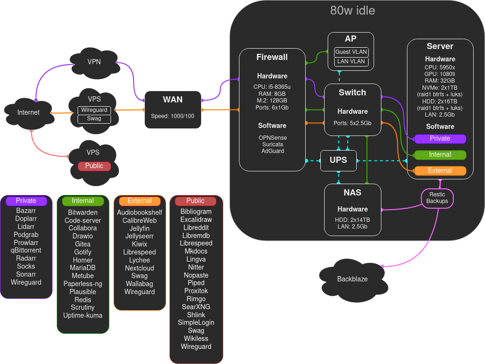

# Setup Diagram Template

Use the following template to create a diagram of your setup.



## Requirements

The [online draw.io](https://app.diagrams.net/) or the [self-hosted draw.io](https://github.com/jgraph/docker-drawio), here is an example compose:
```Yaml
  drawio:
    image: jgraph/drawio:alpine
    container_name: drawio
    ports:
        - 8080:8080
    restart: always
```

## <a href="../files/setup.drawio" style="font-size:30px;">Download</a>