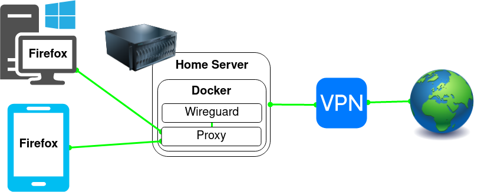

# Route Applications Through a SOCKS Proxy


This setup allows you to route specific applications through randomized SOCKS proxies by your VPN provider without the entire devices having to connect to the VPN.

### TLDR

Use [NGINX](https://github.com/linuxserver/docker-nginx) through a [Wireguard container](https://github.com/linuxserver/docker-wireguard) to load balance between the VPN provider's SOCKS5 proxies and configure applications to use the NGINX proxy.

## Initial VPN Wireguard Client Configuration

Configure your VPN Wireguard Client according to the [Wireguard documentation](https://github.com/linuxserver/docker-wireguard).

```YAML
  vpn:
    image: ghcr.io/linuxserver/wireguard
    container_name: vpn
    cap_add:
      - NET_ADMIN
      - SYS_MODULE
    environment:
      - PUID=1000
      - PGID=1000
      - TZ=Europe/London
    volumes:
      - /path/to/appdata/config:/config
      - /lib/modules:/lib/modules
    restart: unless-stopped
```

Once done start the container and validate that `docker logs vpn` contains no errors (Ignore the missing wg0.conf message).

## Connecting the Wireguard Client to the VPN

Copy the Wireguard configuration that you get from your VPN provider into a file called `wg0.conf` and place it in your VPN Wireguard Client's `config` folder, and make the following changes:

- Remove IPv6 addresses (and ::/0) if you haven't enabled IPv6 in your docker network
- Add the `PostUp` and `PreDown` lines listed below
```Nginx
[Interface]
PrivateKey = <private-key>
Address = <some-address>/32
DNS = <some-address>
PostUp = DROUTE=$(ip route | grep default | awk '{print $3}'); HOMENET=192.168.0.0/16; HOMENET2=10.0.0.0/12; HOMENET3=172.16.0.0/12; ip route add $HOMENET3 via $DROUTE;ip route add $HOMENET2 via $DROUTE; ip route add $HOMENET via $DROUTE;iptables -I OUTPUT -d $HOMENET -j ACCEPT;iptables -A OUTPUT -d $HOMENET2 -j ACCEPT; iptables -A OUTPUT -d $HOMENET3 -j ACCEPT;  iptables -A OUTPUT ! -o %i -m mark ! --mark $(wg show %i fwmark) -m addrtype ! --dst-type LOCAL -j REJECT
PreDown = DROUTE=$(ip route | grep default | awk '{print $3}'); HOMENET=192.168.0.0/16; HOMENET2=10.0.0.0/12; HOMENET3=172.16.0.0/12; ip route del $HOMENET3 via $DROUTE;ip route del $HOMENET2 via $DROUTE; ip route del $HOMENET via $DROUTE; iptables -D OUTPUT ! -o %i -m mark ! --mark $(wg show %i fwmark) -m addrtype ! --dst-type LOCAL -j REJECT; iptables -D OUTPUT -d $HOMENET -j ACCEPT; iptables -D OUTPUT -d $HOMENET2 -j ACCEPT; iptables -D OUTPUT -d $HOMENET3 -j ACCEPT

[Peer]
PublicKey = <public-key>
AllowedIPs = 0.0.0.0/0
Endpoint = <some-address>:<some-port>
```
The PostUp command adds a killswitch using iptables rules to prevent connections on other interfaces. Connections from LAN networks are still allowed to be able to connect to the services in the containers.
The PreDown command cleans up these rules when the VPN goes down.

Save the changes and restart the container with `docker restart vpn`, validate that `docker logs vpn` contains no errors.

Perform the following validations to check that the VPN works:

- Check that you have connectivity by running `docker exec vpn ping 1.1.1.1`
- Check that the VPN is working by running `docker exec vpn curl -s https://am.i.mullvad.net/ip`, you should get an IP that is different from your internet's IP.

## NGINX Configuration

Create an [NGINX container](https://github.com/linuxserver/docker-nginx) using the following compose:

```YAML
---
  proxy:
    image: ghcr.io/linuxserver/nginx
    container_name: proxy
    environment:
      - PUID=1000
      - PGID=1000
      - TZ=Europe/London
    volumes:
      - </path/to/proxy/config>:/config
    network_mode: "service:vpn"
    restart: unless-stopped

```

Edit `/path/to/proxy/config/nginx/nginx.conf`, delete everything and paste the following:

```Nginx
## Version 2021/06/15 - Changelog: https://github.com/linuxserver/docker-baseimage-alpine-nginx/commits/master/root/defaults/nginx.conf

user abc;
worker_processes 4;
pid /run/nginx.pid;
include /etc/nginx/modules/*.conf;

events {
	worker_connections 768;
}

stream {
    upstream stream_backend {
        random;
        server ch5-wg.socks5.mullvad.net:1080;
        server ch6-wg.socks5.mullvad.net:1080;
        server ch7-wg.socks5.mullvad.net:1080;
        server ch8-wg.socks5.mullvad.net:1080;
        server ch9-wg.socks5.mullvad.net:1080;
    }
    
    server {
        listen 1080;
        proxy_pass stream_backend;
    }
}

daemon off;
```

Replace the list of proxy servers such as `server ch5-wg.socks5.mullvad.net:1080` with proxy servers of your VPN provider.

Add the port under the VPN Wireguard Client container:

```YAML
    ports:
      - 1080:1080 # SOCKS proxy
```

Recreate the VPN Wireguard Client container to apply the changes, then recreate the NGINX proxy container which depends on the VPN.

Check that the proxy is working by running the following multiple times, you should get different IPs that are different from your internet's IP.

```
curl --socks5 localhost:1080 https://ifconfig.me
```

Now configure the applications to use the SOCKS proxy on your server's IP and port 1080, and exclude your local domain and IP range.

For example in Firefox:


## Notes

- If there are other containers routed through the same VPN container, the SOCKS proxy will act as another hop meaning if you connect to a VPN in one country and select a SOCKS proxy in another country, it will hop twice which is more secure.

- The performance should be almost identical to not having a SOCKS proxy, if you feel any slowness then select another proxy provided by your VPN provider.