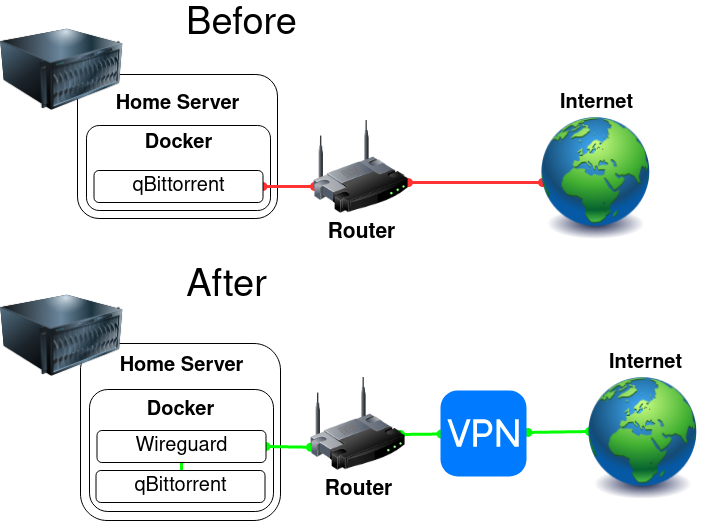

# VPN Route


This setup allows you to route containers through a VPN and protect yourself from your ISP.

This guide is the basic step-by-step version of great blog posts by [Spad](https://spad.uk/wireguard-as-a-vpn-client-in-docker-using-pia/) and [Tokugero](https://bs.tokugero.com/books/wireguard/page/docker-compose-with-mullvad-wireguard-arbitrary-service) which also contain more advanced information.

qBittorrent and Mullvad are used in this guide as an example, but you can route any container the same way, and use any VPN service that supports Wireguard.

## Requirements

- A working instance of [qBittorrent](https://github.com/linuxserver/docker-qbittorrent)

## Initial VPN Wireguard Client Configuration

Configure your VPN Wireguard Client according to the [Wireguard documentation](https://github.com/linuxserver/docker-wireguard).

```YAML
  vpn:
    image: ghcr.io/linuxserver/wireguard
    container_name: vpn
    cap_add:
      - NET_ADMIN
    environment:
      - PUID=1000
      - PGID=1000
      - TZ=Europe/London
    volumes:
      - /path/to/appdata/config:/config
    sysctls:
      - net.ipv4.conf.all.src_valid_mark=1
    restart: unless-stopped
```

Once done start the container and validate that `docker logs vpn` contains no errors (Ignore the missing wg0.conf message).

## Connecting the Wireguard Client to the VPN

Copy the Wireguard configuration that you get from your VPN provider into a file called `wg0.conf` and place it in your VPN Wireguard Client's `config/wg_confs` folder, and make the following changes:

- Remove IPv6 addresses (and ::/0) if you haven't enabled IPv6 in your docker network
- Add the `PostUp` and `PreDown` lines listed below

```Nginx
[Interface]
PrivateKey = <private-key>
Address = <some-address>/32
DNS = <some-address>
PostUp = DROUTE=$(ip route | grep default | awk '{print $3}'); HOMENET=192.168.0.0/16; HOMENET2=10.0.0.0/12; HOMENET3=172.16.0.0/12; ip route add $HOMENET3 via $DROUTE;ip route add $HOMENET2 via $DROUTE; ip route add $HOMENET via $DROUTE;iptables -I OUTPUT -d $HOMENET -j ACCEPT;iptables -A OUTPUT -d $HOMENET2 -j ACCEPT; iptables -A OUTPUT -d $HOMENET3 -j ACCEPT;  iptables -A OUTPUT ! -o %i -m mark ! --mark $(wg show %i fwmark) -m addrtype ! --dst-type LOCAL -j REJECT
PreDown = DROUTE=$(ip route | grep default | awk '{print $3}'); HOMENET=192.168.0.0/16; HOMENET2=10.0.0.0/12; HOMENET3=172.16.0.0/12; ip route del $HOMENET3 via $DROUTE;ip route del $HOMENET2 via $DROUTE; ip route del $HOMENET via $DROUTE; iptables -D OUTPUT ! -o %i -m mark ! --mark $(wg show %i fwmark) -m addrtype ! --dst-type LOCAL -j REJECT; iptables -D OUTPUT -d $HOMENET -j ACCEPT; iptables -D OUTPUT -d $HOMENET2 -j ACCEPT; iptables -D OUTPUT -d $HOMENET3 -j ACCEPT

[Peer]
PublicKey = <public-key>
AllowedIPs = 0.0.0.0/0
Endpoint = <some-address>:<some-port>
```

The PostUp command adds a killswitch using iptables rules to prevent connections on other interfaces, and maintains connections to the web-ui of the services in the containers.
The PreDown command cleans up these rules when the VPN goes down.

Save the changes and restart the container with `docker restart vpn`, validate that `docker logs vpn` contains no errors.

Perform the following validations to check that the VPN works:

- Check that you have connectivity by running `docker exec vpn ping 1.1.1.1`
- Check that the VPN is working by running `docker exec vpn curl -s https://am.i.mullvad.net/ip`, you should get an IP that is different from your internet's IP.

## Routing qBittorrent Through the VPN

Replace the following lines on the qBittorrent container:

```YAML
    ports:
      - 6881:6881
      - 6881:6881/udp
      - 8080:8080
```

With:

```YAML
    network_mode: "service:vpn"
    depends_on:
      - vpn
```

Add the port under the VPN Wireguard Client container:

```YAML
    ports:
      - 8080:8080 # qBittorrent
```

Recreate the VPN Wireguard Client container to apply the changes, then recreate the qBittorrent container which depends on the VPN.

Perform the following validations to check that the VPN works:

- Check that the VPN is working by running `docker exec qbittorrent curl -s https://am.i.mullvad.net/ip` and make sure you don't get your internet's IP.
- Check that qBittorrent's Web Administration interface is working by browsing http://`<server-ip>`:8080.

## Configuring Other Containers

Now that qBittorrent is routed through the VPN, other containers like swag, radarr, sonarr, prowlarr, etc, need to be configured to use `vpn` instead of `qbittorrent` as the container name for reaching qBittorrent.

### SWAG

Edit your `qbittorrent.subdomain.conf` or `qbittorrent.subfolder.conf` in SWAG's config folder under `config/nginx/proxy-confs/`.

Replace all occurrences of `set $upstream_app qbittorrent;` with `set $upstream_app vpn;`.

Restart the SWAG to apply the changes with `docker restart swag`.

### Sonarr / Radarr

Under `Settings` > `Download Clients` > Click qBittorrent's Download Client > Set `Host` to `vpn` > click `Test` & `Save`.

## Notes

### Port forwarding

VPN providers like Torguard support port forwarding, if your application needs it.

Copy the port number you got to `qBittorrent` > `Settings` > `Connection` > `Port used for incoming connections`.

### Restarting order

If you're experiencing problems and you want to restart everything, the correct order is:

- VPN - `docker restart vpn`
- Containers using the VPN - `docker restart <container>`

### Can't connect to the Web-UI of routed containers

Make sure that you have added `PostUp` and `PreDown` to `wg0.conf` as detailed in [Connecting the Wireguard Client to the VPN](https://gist.github.com/quietsy/fa1d6899af13bd7ea9dea4059d1a7a65#connecting-the-wireguard-client-to-the-vpn).

### DNS leaks

If you want to make sure wireguard isn't using your local DNS, add the following to the vpn's compose (Replace `8.8.8.8` with your DNS of choice):
  ```yaml
  dns:
    - 8.8.8.8
  ```
