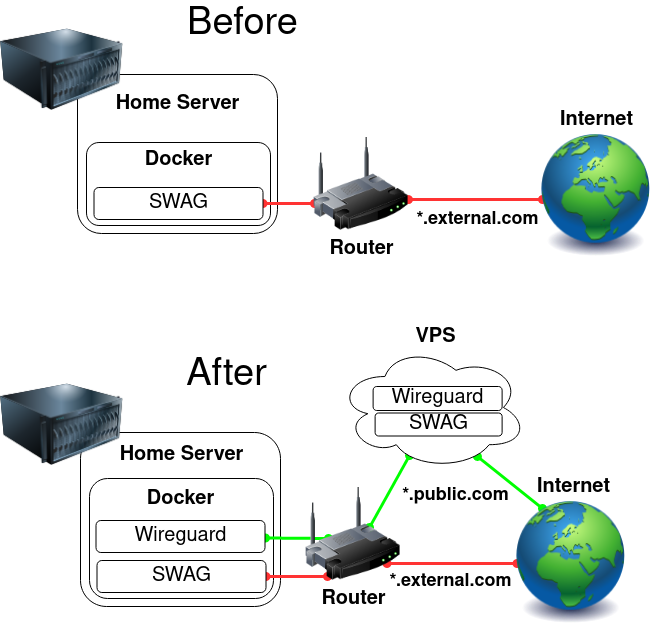
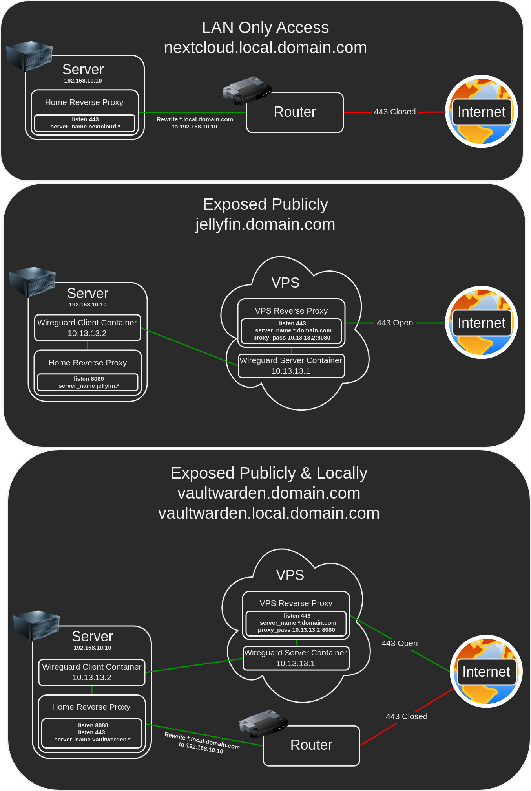

# VPS Proxy



This setup allows you to hide your home IP, protect your privacy and protect your home server against DDOS attacks while keeping all of your data at home.

Once it's up and running, exposing a resource through the VPS is **as simple** as adding one line to your home SWAG.

The TLDR version is:

- Create a VPN tunnel between your home and a VPS
- Configure SWAG to proxy traffic through the tunnel
- Configure Fail2ban to block attackers

There are many ways to create this setup with many variations for many different purposes, in my opinion these containers are easy to work with and to maintain, every container in this setup can be used for other purposes **as well** as being used for the proxy without any compromises:

- Home SWAG can be used as a reverse proxy for all of your other Home server containers.
- Home Wireguard Client can be used to route any container through the VPS.
- VPS SWAG can be used as a reverse proxy for all of your other VPS containers.
- VPS Wireguard Server can be used as your private cloud VPN server.

## Requirements

- A working instance of [SWAG](https://github.com/linuxserver/docker-swag) at home
- A working instance of [SWAG](https://github.com/linuxserver/docker-swag) on the VPS

## Initial VPS Wireguard Server Configuration

Configure your VPS Wireguard Server according to the [Wireguard documentation](https://github.com/linuxserver/docker-wireguard).

```YAML
  wireguard:
    image: ghcr.io/linuxserver/wireguard
    container_name: wireguard
    cap_add:
      - NET_ADMIN
      - SYS_MODULE
    environment:
      - PUID=1000
      - PGID=1000
      - TZ=Europe/London
      - SERVERURL=external.com
      - SERVERPORT=51820
      - PEERS=1
      - PEERDNS=auto
      - INTERNAL_SUBNET=10.13.13.0
      - ALLOWEDIPS=10.13.13.0/24
    volumes:
      - /path/to/appdata/config:/config
      - /lib/modules:/lib/modules
    ports:
      - 51820:51820/udp
    sysctls:
      - net.ipv4.conf.all.src_valid_mark=1
    restart: unless-stopped
```

**Note that `ALLOWEDIPS` is set to only allow access to the Wireguard subnet.**

Once done start the container and validate that `docker logs wireguard` contains no errors.

## Initial Home Wireguard Client Configuration

Configure your Home Wireguard Client according to the [Wireguard documentation](https://github.com/linuxserver/docker-wireguard).

```YAML
  wireguard:
    image: ghcr.io/linuxserver/wireguard
    container_name: wireguard
    cap_add:
      - NET_ADMIN
      - SYS_MODULE
    environment:
      - PUID=1000
      - PGID=1000
      - TZ=Europe/London
    volumes:
      - /path/to/appdata/config:/config
      - /lib/modules:/lib/modules
    restart: unless-stopped
```

Once done start the container and validate that `docker logs wireguard` contains no errors (Ignore the missing wg0.conf message).

## Connecting the Wireguard Client to the Wireguard Server

Copy `peer1.conf` from your VPS Wireguard Server's `config/peer1/` folder to your Home Wireguard Client's `config` folder and rename it to `wg0.conf`.

Edit your Home Wireguard Client's `wg0.conf`, remove the `DNS` line and add the `PersistentKeepalive = 25` line under `Peer`, it should look like this:
```Nginx
[Interface]
Address = 10.13.13.2
PrivateKey = <private-key>
ListenPort = 51820

[Peer]
PublicKey = <public-key>
Endpoint = <domain>:51820
AllowedIPs = 10.13.13.0/24
PersistentKeepalive = 25
```
Save the changes and restart the container on your Home server with `docker restart wireguard`, validate that `docker logs wireguard` contains no errors.

Validate that the tunnel is working by pinging both sides:

- On the Home server run - `docker exec wireguard ping 10.13.13.1`
- On the VPS run - `docker exec wireguard ping 10.13.13.2`

## Configuring the VPS SWAG to Use the Tunnel

Replace the following lines on the VPS SWAG container:

```YAML
    ports:
      - 443:443
      - 80:80
```

With:

```YAML
    network_mode: "service:wireguard"
    depends_on:
      - wireguard
```

Add the ports under the VPS Wireguard Server container:

```YAML
    ports:
      - 80:80
      - 443:443
      - 51820:51820/udp
```

Add the following to the bottom of the VPS SWAG configuration under `config/nginx/site-confs/default`:

```Nginx
server {
    listen 443 ssl;
    server_name *.external.com;
    include /config/nginx/ssl.conf;
    client_max_body_size 0;

    location / {
        include /config/nginx/proxy.conf;
        resolver 127.0.0.11 valid=30s;
        proxy_pass http://10.13.13.2:8080;
    }
}
```

Recreate the VPS Wireguard Server container to apply the changes, then recreate the VPS SWAG container which depends on the tunnel.

## Configuring the Home SWAG to Use the Tunnel

Replace the following lines on the Home SWAG container:

```YAML
    ports:
      - 443:443
      - 80:80
```

With:

```YAML
    network_mode: "service:wireguard"
    depends_on:
      - wireguard
```

Add the ports under the Home Wireguard Client container:

```YAML
    ports:
      - 80:80
      - 443:443
      - 51820:51820/udp
```

Configure the Home SWAG to see the real IP of connections coming from the tunnel by adding the following inside the `http` section in `config/nginx/nginx.conf`:

```Nginx
	set_real_ip_from 10.13.13.1/32;
	real_ip_header X-Forwarded-For;
```

In order to catch all the unused subdomains and redirect to an error page, add `listen 8080 default_server;` to `config/nginx/site-confs/default` under the main server block:

```Nginx
# main server block
server {
	listen 8080 default_server;
	listen 443 ssl http2 default_server;
```

Expose a container through the tunnel by adding `listen 8080;` to it's proxy configuration, for example:

```Nginx
server {
    listen 8080;
    listen 443 ssl;
    server_name heimdall.*;
    include /config/nginx/ssl.conf;
    client_max_body_size 0;

    location / {
        include /config/nginx/proxy.conf;
        resolver 127.0.0.11 valid=30s;
        set $upstream_app heimdall;
        set $upstream_port 443;
        set $upstream_proto https;
        proxy_pass $upstream_proto://$upstream_app:$upstream_port;

    }
}
```

Recreate the Home Wireguard Client container to apply the changes, then recreate the Home SWAG container which depends on the tunnel.

Validate that the containers you exposed now work through the tunnel by browsing `https://<container>.external.com/`.

## Traffic Overview



## Fail2ban

Now that everything is working, Fail2ban should ban the right IP of attackers, but they're coming in through the tunnel and iptables isn't blocking them, therefore we will block them through NGINX.

Create a file called `nginx.conf` in your Home SWAG under `config/fail2ban/action.d/` with the following:

```Nginx
[INCLUDES]

[Definition]

actionstart = touch /config/nginx/blocklist.conf
actionstop = 
actioncheck = 
actionban = grep -qxF "deny <ip>;" /config/nginx/blocklist.conf || echo "deny <ip>;" >> /config/nginx/blocklist.conf && /bin/s6-svc -r /var/run/s6/services/nginx
actionunban = sed -i '/deny <ip>;/d' /config/nginx/blocklist.conf && /bin/s6-svc -r /var/run/s6/services/nginx

[Init]

name = default
```

Edit `config/fail2ban/jail.local` and add `nginx` to the `action` of all the jails, for example:

```Nginx
[authelia]
enabled  = true
filter   = authelia
port     = http,https
logpath  = /authelia/authelia.log
action  = iptables-allports[name=authelia]
          nginx
```

Add the following line into the `http` section in `config/nginx/nginx.conf`:

```Nginx
	include /config/nginx/blocklist.conf;
```

Restart the Home SWAG to apply the changes with `docker restart swag`.

## Notes

### Exposing more containers
Expose more containers by simply adding `listen 8080;` to their proxy configuration on the Home server, for example:

```Nginx
server {
    listen 8080;
    listen 443 ssl;
```

Restart Home SWAG by running `docker restart swag` to apply the changes.

### Restarting order

If you're experiencing problems and you want to restart everything, the correct order is:

- VPS - `docker restart wireguard`
- VPS - `docker restart swag`
- Home - `docker restart wireguard`
- Home - `docker restart swag`

### Authelia / Authentik

If you expose Authelia/Authentik through the tunnel, you need to make a small adjustment for the redirects to work.

The idea is to force https, since traffic through the tunnel is coming over as http but the VPS exposes https.

Edit Authelia/Authentik confs under `config/nginx/`, replace `$scheme` with `https`.

Restart the Home SWAG to apply the changes with `docker restart swag`.

### Exposing a resource only through one domain but not the other

You control what gets exposed where in 2 ways:

- Through the `listen <port>;` setting, 8080 is through the VPS and 443/80 is directly.
- Through the `server_name something.external.com` setting, if you explicitely specify the full address.

If a resource isn't exposed, the default action under the main server block in your Home SWAG will apply.


### Attackers are filling my logs with Access Denied!

If you want attackers to be redirected instead of showing them an error page and avoid them spamming the logs with 403 errors, add the following inside the `http` section in `config/nginx/nginx.conf` on both SWAGs:

```Nginx
    error_page 400 403 404 444 500 502 503 504 http://www.google.com/;
```

Restart the Home SWAG to apply the changes with `docker restart swag`.